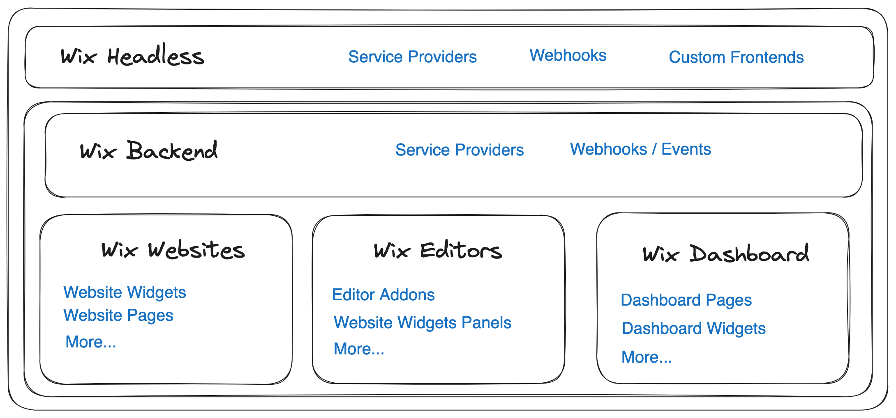

# Introduction

Wix Smarts is a React framework for building on top of, and integrating into, the Wix Developer Platform. It provides a collection of tools, components, and utilities that help you build online experiences, from websites, mobile apps to chatbots and more. With Wix Smarts, you can enjoy a great developer experience and high-quality building blocks that will streamline your development with the Wix Developer Platform.

Before jumping into the details, let's start with a high-level overview of the Wix Developer Platform and Wix Smarts. Understading the offering of the Wix Developer Platform and the role of Wix Smarts will help you understand how to use Wix Smarts to build your next project.

## Wix Developer Platform

The Wix Developer Platform provides developers with an extensive set of APIs, tools, and services to build, manage, and grow their online projects. Together with the Wix Dashboard for managing all of your (and your clients') back office needs, the Wix Developer Platform is a comprehensive solution for building and managing online experiences.

Wix is known for its leading WYSIWYG website builders, Wix Editor and Wix Studio, which allow users to create websites without writing code. The Wix Developer Platform extends the capabilities of the Wix Editor by providing APIs and tools for developers to build custom solutions on top of Wix. This includes building custom websites, mobile apps, chatbots, and more. Through the extendability of the Wix Developer Platform (more on that in the next section), Wix provides comprehensive business solutions for a wide range of use cases.

These are some of the key business solution APIs provided by the Wix Developer Platform:

- Wix Stores APIs: Build custom storefronts and manage and sell products.
- Wix Bookings APIs: Build custom booking experiences to sell services and manage appointments, classes, groups sessions and more.
- Wix CMS APIs: Build any content-driven experience with the Wix CMS APIs.
- Wix Members APIs: Allow your users to sign up, log in, and manage their profiles.
- Wix Blog APIs: Build custom blog experiences to manage and publish posts, categories, and more.
- Wix Events APIs: Build custom event experiences to manage RSVPs, sell tickets, and more.
- Wix Restaurants APIs: Build custom restaurant experiences to manage menus, orders, reservations, and more.
- Wix Forms APIs: Build custom forms to manage form submissions, collect data, and more.
- [And so much more...](https://www.wix.com/app-market/collection/wix-business-solutions)

### Wix Apps - The building blocks of the Wix Developer Platform

At the core of the Wix Developer Platform are Wix Apps. The platform is built around extendability and composability, and Wix Apps are the building blocks that enable developers to extend and compose the Wix Dashboard, Wix Editor and Wix Business Solutions logic. When you create a new project at Wix, you'll get a Wix Dashboard with some pre-installed Wix Apps, that enable basic back office functionality. You can then extend the Wix Dashboard or Editor with custom Wix Apps to provide additional functionality, either by installing Wix Apps from the Wix App Market or by building your own custom Wix Apps.

Wix Apps can extend the Wix Platform in many ways, including:

- Adding new functionality to the Wix Dashboard by:
  - Adding new dashboard pages
  - Configuring the dashboard sidebar
  - Extending known dashboard slots (integrating into existing dashboard pages)
- Adding new functionality to the Wix Editor by:
  - Adding new editor elements
  - Adding new editor pages
  - Extending the Editor itself with Editor Addons
- Customizing the Wix Business Solutions logic by:
  - Hooking into known business logic extensions points also known as SPIs (Service Provider Interfaces).
  - Listening to events (Webhooks) and acting upon them

There are many more extension points and more are being added all the time. Together with a comprehensive set of APIs, Wix Apps make up the Wix Developer Platform.

To learn more about Wix Apps development:

- Check out the [Wix Apps documentation](https://dev.wix.com/docs/build-apps)
- Read the [Wix Apps architecture deep dive](./deep-dive/wix-apps-deep-dive.md)

### Wix Headless - Custom frontends with the Wix Developer Platform

Wix Headless is a new offering from Wix that allows developers to build custom frontends on top of the Wix Developer Platform. With Wix Headless, you can build custom websites, mobile apps, chatbots, or any custom frontend you can imagine. It embraces the headless CMS architecture, where the frontend is decoupled from the backend, and provides a set of APIs and tools to build custom frontends on top of the Wix Developer Platform.

## Wix Smarts
